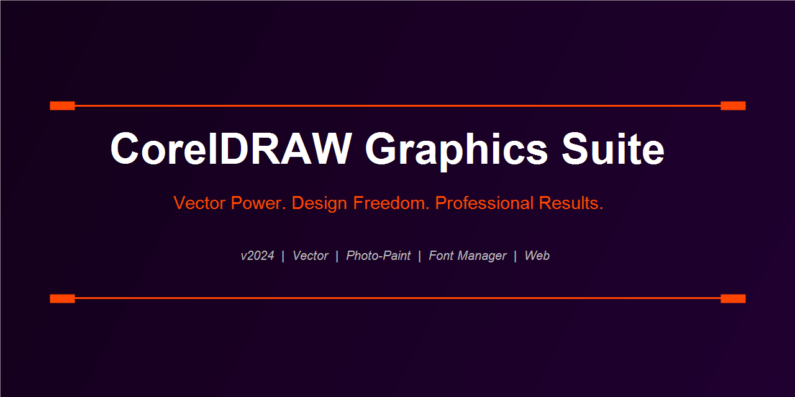

  

 

---

## Applications in the Suite

**CorelDRAW 2024** — The vector illustration and page layout application. Logos, signage, technical illustration, multi-page print documents, packaging dielines.

**Corel Photo-Paint 2024** — The pixel editor. Retouching, compositing, photo manipulation, texture creation. Direct round-trip with CorelDRAW via Edit Bitmap command.

**Corel Font Manager 2024** — Browse, manage, and temporarily activate fonts from any folder without installing them system-wide. Preview on any text instantly.

**CorelDRAW.app** — Browser-based companion app. Open, annotate, and share CDR files from any device. Stakeholder review without software installation.

---

## Vector Illustration

The node editing system is the most mature in the industry — every node type (cusp, smooth, symmetrical) has keyboard shortcuts, and the Property Bar updates in context. The PowerClip container clips any object to any shape. The Artistic Media tool applies brush strokes, sprays, and expressions along any path.

### Shape & Object Tools
Ellipse, rectangle, polygon, star, spiral, table, basic shapes library — all parametric. Modify corner radii, point counts, and inner ratios numerically after drawing. Smart fill creates closed paths from intersecting open ones.

---

## Typography

**Paragraph text** with full typographic control: OpenType features (ligatures, swashes, small caps, fractions), baseline grid snap, text flow between linked frames, text on path with precise offset control.

**Character styles and paragraph styles** cascade like CSS. Change the base style and every text object using it updates.

**Variable fonts** — axis sliders for weight, width, slant directly in the text properties panel.

---

## Print Production

Impositions, printer's marks, color separations, spot color management, ICC profile embedding, soft proofing against press profiles, preflight checker with custom rule sets. CorelDRAW has been a print shop staple for 30 years because the PDF/X output is reliable.

### Color Management
- Pantone Matching System (PMS) integration
- Spot to CMYK conversion with overprint control
- GRACoL, SWOP, Fogra39 press profiles built in

---

## Sign & Vinyl Cutting

Direct cutter/plotter output via CorelDRAW plug-ins for Roland, Graphtec, Mimaki, Summa, and CUTMASTER. Contour cutting guides, weed lines, tile and repeat for large-format.

---

## Web & Digital Output

Export to SVG, PDF, PNG, JPEG, GIF, WEBP. Pixel grid alignment mode snaps objects to exact pixel boundaries for crisp raster export. HTML export for basic web graphics.

---

  

---

`coreldraw graphics suite` `coreldraw 2024 download` `coreldraw free` `coreldraw full version` `coreldraw review` `coreldraw vector illustration` `coreldraw vs illustrator` `corel photo-paint` `coreldraw sign making` `coreldraw print design` `coreldraw windows 11` `coreldraw typography` `corel graphics suite 2024`

